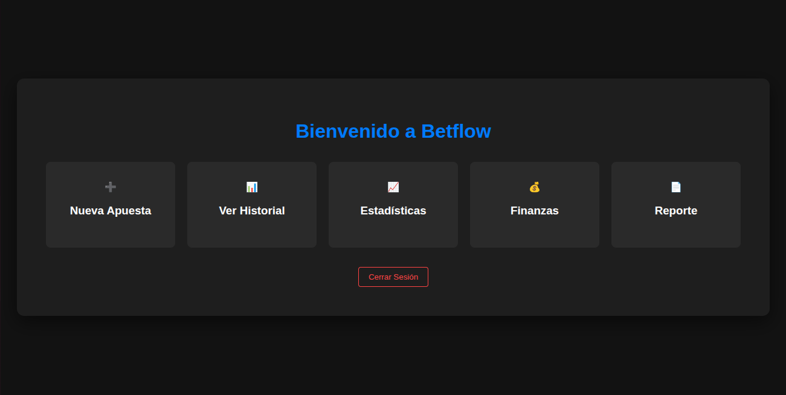
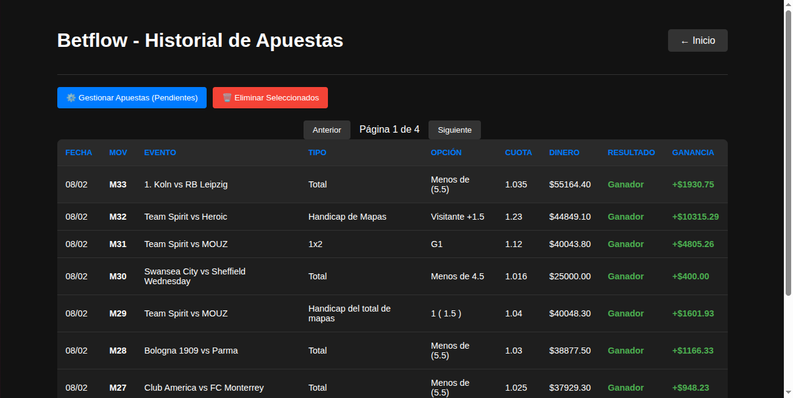
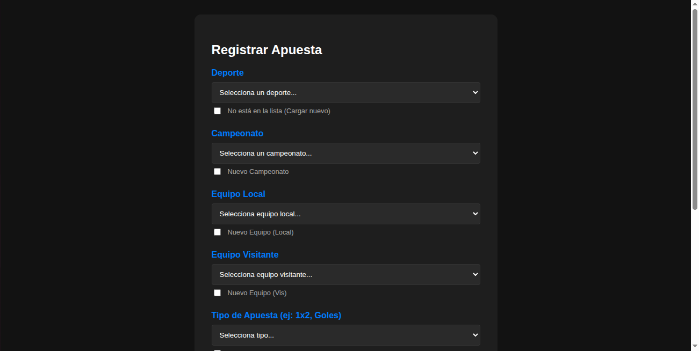
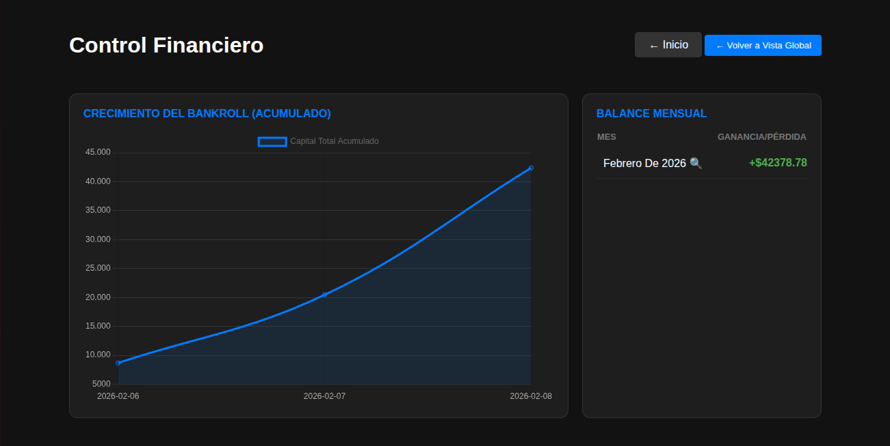

# 🏆 Sistema Integral de Gestión de Apuestas (Betflow)

Una solución completa para el tracking de movimientos, análisis de rendimiento y visualización de datos en tiempo real, desarrollada con un enfoque en la experiencia de usuario y la integridad de la información.

## 🚀 Funcionalidades Clave

### 📊 Dashboard Interactivo y Gráficos Dinámicos
La joya del proyecto es su sistema de análisis visual sin recarga de página:
- **Navegación Fluida:** Al hacer clic en un **Mes**, la aplicación filtra automáticamente y muestra los días correspondientes con sus respectivas apuestas, actualizando los gráficos al instante.
- **Detalle por Día:** Al seleccionar un **Día**, el sistema desglosa todas las apuestas realizadas en esa fecha específica, ajustando la métrica visual de rendimiento en tiempo real.
- **Análisis de Rendimiento:** Visualización clara de ganancias, pérdidas y balances acumulados.

### ⚙️ Gestión de Movimientos y Lógica de Negocio
- **Control de Apuestas:** Registro detallado de cada jugada (Eventos, Cuotas, Resultados).
- **Sistema de Movimientos (M1, M2...):** Implementación de una estructura lógica para el seguimiento secuencial de movimientos financieros.
- **Persistencia con Supabase:** Backend robusto utilizando PostgreSQL para el manejo de datos y almacenamiento seguro.

## 🛠️ Tecnologías Utilizadas
- **Frontend:** HTML5, CSS3 (Flexbox/Grid) y JavaScript (ES6+).
- **Backend:** Node.js con Express para la lógica de negocio.
- **Database:** [Supabase](https://supabase.com/) (PostgreSQL).
- **Visualización:** Chart.js (Gráficos interactivos).
- **Reportes:** jsPDF y jsPDF-AutoTable (Generación de PDF en cliente).

## 📸 Capturas de Pantalla

| Dashboard General | Historial de Apuestas |
|---|---|
|  |  |

| Registro de Apuesta | Análisis por Mes/Día |
|---|---|
|  | | 

## 📦 Instalación y Configuración

Sigue estos pasos para configurar el entorno de desarrollo localmente:

1. **Clonar el repositorio:**
   ```bash
   git clone https://github.com/MiguelAngelBusto/sistema-gestion-apuestas.git
   cd sistema-gestion-apuestas
   
2. **Instalar Dependencias**
    ```bash
    npm install

3. **Configurar variables de entorno:**
Crea un archivo llamado .env en la raíz del proyecto y añade tus credenciales de Supabase:
    ```bash
    SUPABASE_URL= 'Tu url de SupaBase'
    SUPABASE_KEY= 'Tu Key de la BD de SupaBase'
    PORT=3000

4. **Ejecuta el servidor:**
    ```bash
    npm start